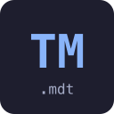

<p align="center">
  
</p>

<h1 align="center">typemark</h1>

<p align="center">Typed prompt templates for TypeScript. Change your prompt, break your build.</p>

`.mdt` files are prompt templates with a TypeScript `Props` interface baked into the frontmatter. When you rename a field, add a property, or change a type, every call site that renders that template gets a type error. No more broken prompts slipping into production.

```
---
interface Props {
    user: {
        firstName: string;
        age: number;
    }
}
---

Hello, ${user.firstName}. You are ${user.age}!
```

```ts
import { parse, compile } from "typemark";

const source = await Bun.file("prompt.mdt").text();
const template = compile(parse(source));

template.render({ user: { firstName: "Alice", age: 30 } });
// => "Hello, Alice. You are 30!"

template.render({ user: { firstName: "Alice" } });
//                ^^ Type error: missing property 'age'
```

## Why

Every app that talks to an LLM has prompts. Those prompts have variables. Those variables come from your code. When the prompt changes and the code doesn't, the result is a silently broken prompt that's hard to catch in review and impossible to catch at runtime.

Typemark makes this a compile-time error. The `.mdt` file is the single source of truth for both the template and its type contract.

## Install

```bash
bun add typemark
```

## The `.mdt` format

An `.mdt` file has two parts separated by `---` fences:

1. **Frontmatter** -- TypeScript type declarations. Must contain an `interface Props { ... }`. Can also contain `import type` statements and helper interfaces/types.
2. **Body** -- The template text. Uses `${expr}` syntax (standard JS template literals). Props are destructured at the top level, so you write `${user.name}` not `${props.user.name}`.

### Inline types

```
---
interface Props {
    name: string;
    isAdmin: boolean;
}
---

Hello, ${name}. ${isAdmin ? "Welcome back, admin." : ""}
```

### Imported types

```
---
import type { User } from "@prisma/client";

interface Props {
    user: User
}
---

Hello, ${user.firstName}. You are ${user.age}!
```

### Helper interfaces

```
---
interface Hobby {
    name: string;
    description: string;
}

interface Props {
    user: {
        firstName: string;
        hobbies: Hobby[];
    }
}
---

${user.firstName}'s hobbies:
${user.hobbies.map(h => ` * ${h.name}: ${h.description}`).join("\n")}
```

### Full expressions

The body is a JS template literal. Anything that works in `${}` works here -- ternaries, method calls, `.map().join()`, arithmetic, nested template literals:

```
---
interface Props {
    user: {
        isAdmin: boolean;
        tasks: string[];
    }
}
---

${user.isAdmin ? `
You are an admin. Your tasks:
${user.tasks.map(task => ` * ${task}`).join("\n")}
` : ``}
```

## Generate `.d.ts` files

For full type-checking in your editor, generate declaration files next to your `.mdt` files:

```bash
bunx typemark generate              # all **/*.mdt files
bunx typemark generate "prompts/**" # custom glob
bunx typemark watch                 # regenerate on change
```

This creates a `prompt.mdt.d.ts` for each `prompt.mdt`:

```ts
declare const template: import("typemark").Template<{
    user: {
        firstName: string;
        age: number;
    }
}>;
export default template;
```

Now your editor knows the exact shape of every template.

## Bun loader

Import `.mdt` files directly in Bun with the loader plugin:

```bash
bun add typemark-loader
```

Add to `bunfig.toml`:

```toml
preload = ["typemark-loader"]
```

Then import and render:

```ts
import prompt from "./prompt.mdt";

const result = prompt.render({ user: { firstName: "Alice", age: 30 } });
```

Combined with `typemark generate`, this gives you full type safety at both the editor and runtime level.

## API

### `parse(source: string): ParsedTemplate`

Parse an `.mdt` source string into its parts.

```ts
import { parse } from "typemark";

const parsed = parse(source);
// parsed.imports    -- import type statements
// parsed.preamble   -- helper interfaces/types
// parsed.propsBody  -- raw content of interface Props { ... }
// parsed.propKeys   -- top-level property names ["user", "count", ...]
// parsed.body       -- template body text
```

### `compile(parsed: ParsedTemplate): Template`

Compile a parsed template into a render function.

```ts
import { parse, compile } from "typemark";

const template = compile(parse(source));
template.render({ user: { firstName: "Alice", age: 30 } });
template.raw; // the raw template body string
```

### `compileToString(parsed: ParsedTemplate): string`

Compile a parsed template into a JavaScript module string. Used by the Bun loader and for custom build tooling.

### `generateDts(parsed: ParsedTemplate): string`

Generate a `.d.ts` declaration file from a parsed template.

### `generateDtsForFile(filePath: string): Promise<string>`

Read an `.mdt` file and return its `.d.ts` content.

## VS Code / Cursor extension

The `typemark-vscode` package provides syntax highlighting for `.mdt` files -- TypeScript in the frontmatter, template expression highlighting in the body.

```bash
cd packages/typemark-vscode
vsce package --allow-missing-repository
cursor --install-extension typemark-vscode-0.1.0.vsix
```

## Packages

| Package | Description |
|---|---|
| `typemark` | Core library -- parser, compiler, codegen, CLI |
| `typemark-loader` | Bun plugin for importing `.mdt` files |
| `typemark-vscode` | VS Code/Cursor syntax highlighting extension |

## License

MIT
